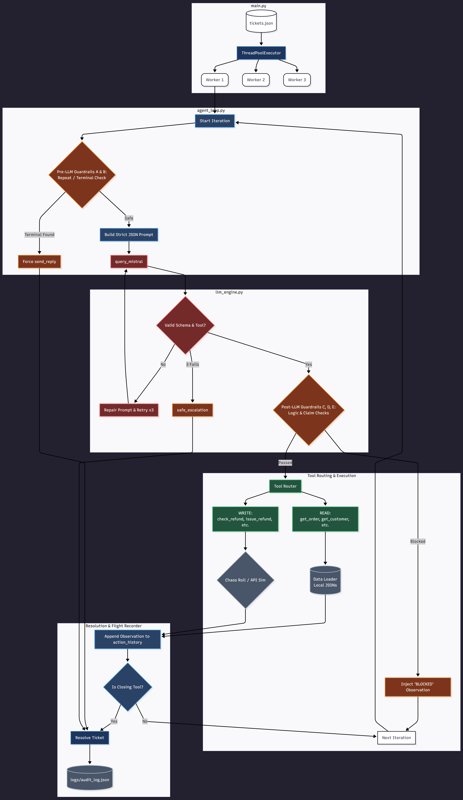

# 🤖 Autonomous Support Resolution Agent
**Agentic AI Hackathon 2026 Submission**

An autonomous, fault-tolerant AI agent designed to ingest, classify, resolve, and audit customer support tickets concurrently. Built with deterministic guardrails and a custom reasoning loop to prevent hallucinations, infinite loops, and fragile behavior typical of LLM-based systems.

## 🎥 Demo Video

https://github.com/<your-username>/<repo-name>/assets/<video-id>

## 🧠 Problem Overview
Modern support systems are overwhelmed with repetitive tickets that are still routed to humans. This agent solves that by acting as a generalist autonomous support system, capable of:
* Understanding user intent
* Taking multi-step actions using tools
* Making safe decisions (with validation)
* Escalating when uncertain
* Logging every step for full transparency

## 🛠️ Tech Stack
* **Language:** Python 3.10+
* **LLM Engine:** Mistral 7B (Local via Ollama)
* **Architecture:** Custom ReAct (Reason + Act) Loop
* **Concurrency:** ThreadPoolExecutor (bounded, max_workers=3)
* **Data Layer:** Local JSON Mock APIs
* **Logging:** Structured JSON audit logs

## 🏗️ Architecture Overview


The system is built using a Custom ReAct Loop with deterministic control:
1. Ingest ticket from queue
2. Classify intent using LLM
3. Plan tool sequence (multi-step reasoning)
4. Execute tools with retry + validation
5. Take action (resolve or escalate)
6. Log every step in audit trail

Concurrency is applied at the ticket level, enabling parallel processing while maintaining hardware stability.

## 🔌 Tooling Layer
The agent interacts with deterministic tools simulating real backend APIs.

**READ / LOOKUP**
* `get_order(order_id)` → Order details, timestamps, notes
* `get_customer(email)` → Customer profile, history
* `search_knowledge_base(query)` → Policy / FAQ retrieval

**WRITE / ACTION**
* `check_refund_eligibility(order_id)` → Eligibility check (failure-prone)
* `issue_refund(order_id, amount)` → Irreversible action
* `send_reply(ticket_id, message)` → Customer response
* `escalate(ticket_id, summary, priority)` → Human handoff

All tools are intentionally designed to simulate real-world API instability, including timeouts and malformed JSON payloads.

## 🧩 Supported Ticket Types
The agent is a generalist system and dynamically handles:
* **Refund Requests:** `get_order` → `check_refund_eligibility` → `issue_refund` → `send_reply`
* **Order Status Queries:** `get_order` → `send_reply`
* **Policy Queries:** `search_knowledge_base` → `send_reply`
* **Ambiguous / Failure Cases:** `escalate` with structured summary

## ⚙️ Key Engineering Features
**1. ⚡ Bounded Concurrency**
* Uses `ThreadPoolExecutor(max_workers=3)`
* Prevents local LLM overload (Ollama-safe)
* Ensures parallel ticket processing

**2. 🔥 Chaos Engine (Robust Parsing + Failure Handling)**
Local LLM outputs are unreliable. This system includes:
* JSON-first parsing strategy via regex extraction
* Stack-trace injection (feeds API errors directly back into the LLM context)
* Safe escalation if inference timeouts occur

**3. 🧱 Deterministic Guardrails**
LLMs are not trusted blindly. Hardcoded controls enforce safety:
* **Amnesia Loop Interceptor:** Detects and blocks repeating `get_order` cycles when the LLM forgets parameters.
* **Lie Catcher:** Blocks the `send_reply` tool if the LLM falsely claims a refund was processed before actually calling `issue_refund`.
* **Step Limit:** Caps the ReAct loop at 7 cycles to prevent infinite processing.

**4. 🔁 Error Recovery System**
* Tool failures (like 502s or Timeouts) do not crash the app.
* Stack traces are intercepted and fed directly back into the LLM's context window, allowing the agent to dynamically retry or escalate.

## 📊 Audit Logging (Full Transparency)
All decisions are recorded in `logs/audit_log.json`.
Each ticket log includes:
* Ticket ID
* Final Resolution Status
* Step-by-step history:
  * Cycle Number
  * Tool invoked
  * Tool input dictionary
  * Tool execution result (Success, Failure, or Blocked)

This acts as a transparent flight recorder for the agent’s reasoning.

## 📏 Constraint Compliance
This system strictly adheres to hackathon rules:
* ✅ Minimum 3 tool calls per reasoning chain demonstrated.
* ✅ Concurrent processing implemented (bounded for local execution).
* ✅ Robust failure handling (timeouts, malformed data, schema hallucinations).
* ✅ Fully data-agnostic (no hardcoding to sample data).
* ✅ Explainable decisions (complete JSON audit logs).

## ⚙️ Setup Instructions
1. Install Python 3.10+
2. Install Ollama → https://ollama.com/
3. Pull model: `ollama run mistral`
4. Install dependencies: `pip install -r requirements.txt`

## 🚀 How to Run
Run the entire system with a single command:
```bash
python main.py
```
*Note: The system will automatically ingest `data/tickets.json`, process the queue using 3 concurrent workers, and generate a final flight recorder in `logs/audit_log.json`.*

## 📂 Deliverables Checklist
- [x] **`README.md`**: Setup instructions, run commands, and tech stack.
- [x] **`architecture.pdf`**: 1-page diagram of the agent loop and tool design.
- [x] **`failure_modes.md`**: Documentation of specific failure scenarios and system responses.
- [x] **`logs/audit_log.json`**: The complete flight recorder showing tool calls and reasoning for all 20 tickets.
- [x] **`demo_video.mp4`**: A recorded screen capture of the agent processing the queue.

## 🧠 Final Note
This system is designed with a core philosophy:

LLMs are not trusted — they are supervised.

All reasoning is constrained, all actions are validated, and all decisions are logged.

The result is not just an AI assistant, but a resilient, inspectable system that behaves predictably under real-world failure conditions.